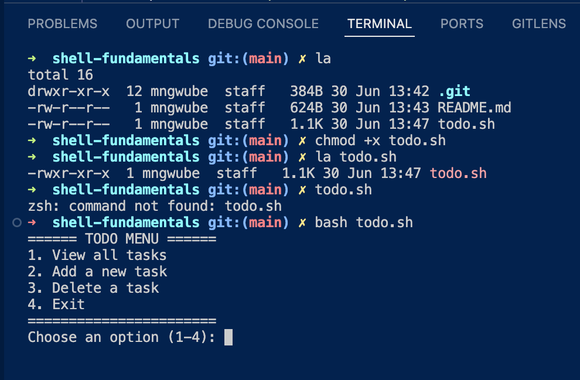
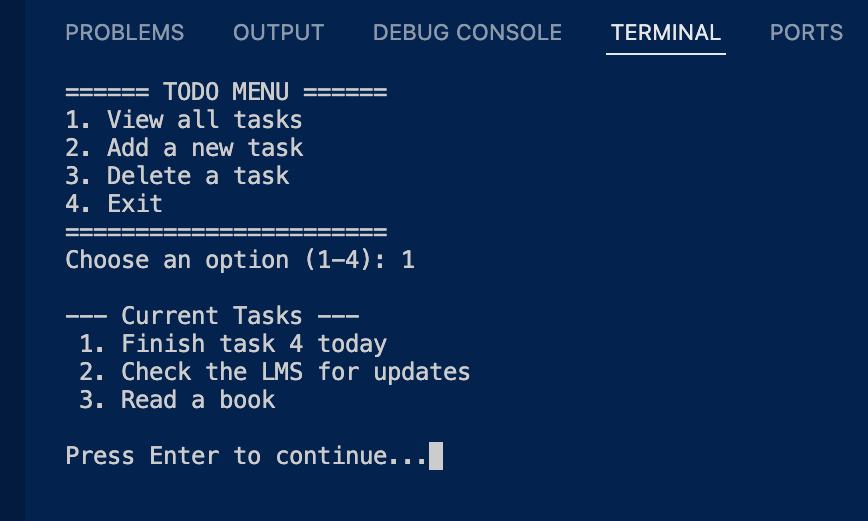
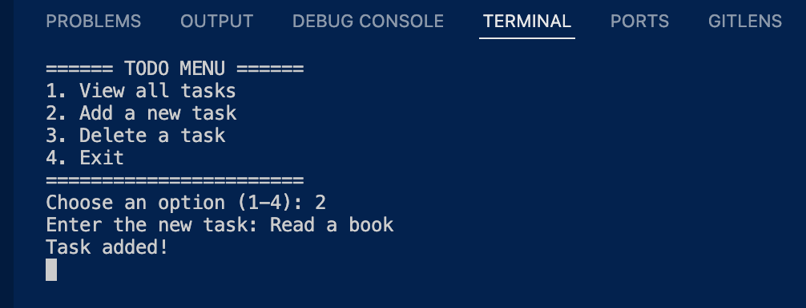
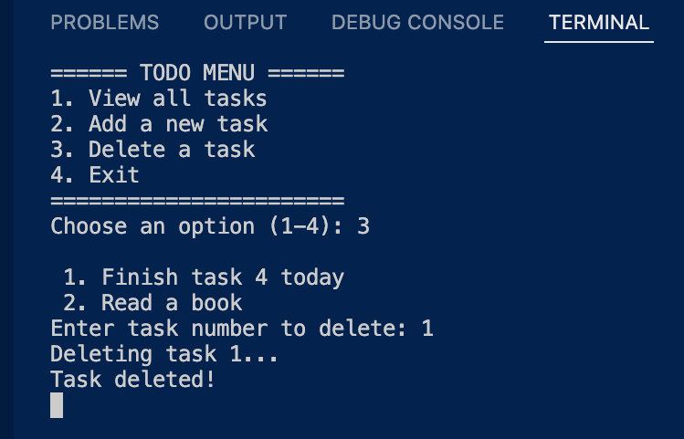
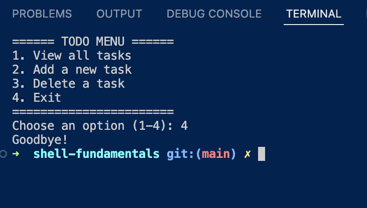

# shell-fundamentals

# Simple Bash Todo App

This is a terminal-based Todo List script in Bash. Tasks are stored in `./todo.txt`.

## Menu

This is the main menu that is shown when the script runs. I am using a while loop to keep the shell running.

---

## View All Tasks

Displays the list of all tasks with line numbers. Here I am using the `nl` command to number the lines to give an itemized view.

---

## Add a New Task

Here, I added a task called "Read a book". Using `echo` and the redirect operator `>>` to append the new task without overwriting existing tasks.

---

## Delete a Task

This shows deleting task #1 from the list, using `sed` command to delete the specified line number in `todo.txt`

---

## Exit

You can exit by choosing option 4. It simply interupts the while loop and terminates the shell by returning with a success status of 0.